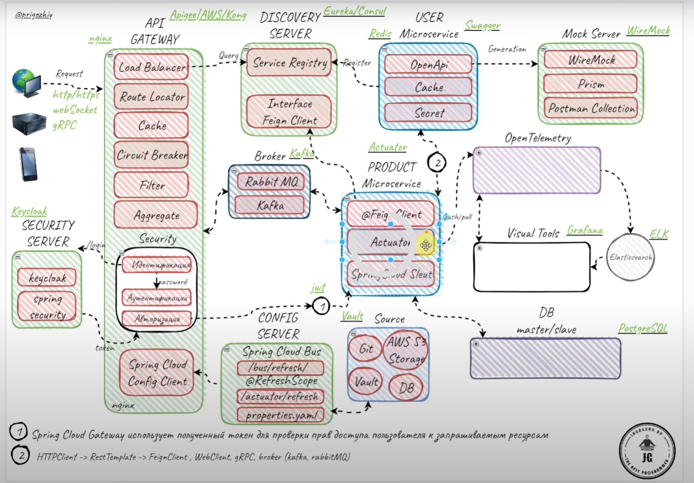

# SPRING CLOUD

## API GATEWAY

Через него входят запросы. Перед ним может стоять Nginx, для того чтобы трафик
фильтровать, если несколько gateway и перенаправлять.

Входит:

- Load Balancer
- Route Locator
- Cache
 

## DISCOVERY SERVER

Eureka/Consul

## SECURITY SERVER

## CONFIG SERVER